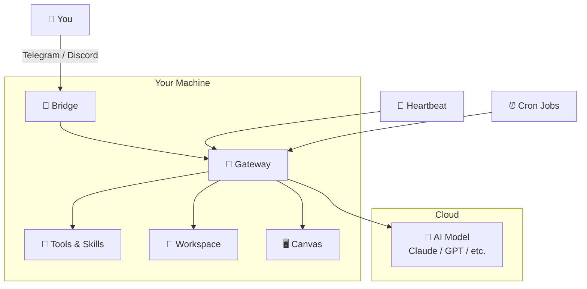

# 🦞 OpenClaw Starter Kit

[](LICENSE)
[](guides/windows-install-guide.md)
[](https://openclaw.ai)

**Get started with OpenClaw on Windows without the headaches.**

A community-maintained collection of templates, guides, and troubleshooting solutions born from real installation pain. Every error documented here was encountered and solved firsthand.

---

## 📋 Table of Contents

- [Quick Start](#-quick-start)
- [Prerequisites](#-prerequisites)
- [Common Errors](#-common-errors-at-a-glance)
- [Architecture Overview](#-architecture-overview)
- [Templates](#-templates)
- [Guides](#-guides)
- [Examples](#-examples)

---

## 🚀 Quick Start

```powershell
# 1. Open PowerShell (not cmd!)
# 2. Set execution policy
Set-ExecutionPolicy -Scope CurrentUser -ExecutionPolicy RemoteSigned

# 3. Install OpenClaw
npm install -g openclaw@latest

# 4. Run setup
openclaw setup

# 5. Configure everything
openclaw configure

# 6. Start the gateway
openclaw gateway
```

Hit an error? Check the [Common Errors](#-common-errors-at-a-glance) table below or the [detailed guide](guides/common-errors.md).

---

## ✅ Prerequisites

| Requirement | Version | How to Get It |
|------------|---------|---------------|
| **Windows** | 10/11 | — |
| **PowerShell** | 5.1+ | Pre-installed on Windows |
| **Node.js** | 18+ (LTS recommended) | [nodejs.org](https://nodejs.org/) |
| **Git** | Any recent | [git-scm.com](https://git-scm.com/download/win) |
| **Telegram** | Latest | App store / [telegram.org](https://telegram.org/) |
| **Anthropic Account** | — | [anthropic.com](https://www.anthropic.com/) |

---

## ⚠️ Common Errors at a Glance

| # | Error | Quick Fix |
|---|-------|-----------|
| 1 | `'iwr' is not recognized` | You're in cmd, not PowerShell. Open PowerShell. |
| 2 | `running scripts is disabled on this system` | `Set-ExecutionPolicy -Scope CurrentUser -ExecutionPolicy RemoteSigned` |
| 3 | `npm error syscall spawn git` / ENOENT | Install Git for Windows, restart PowerShell |
| 4 | `npm error code ENOENT` on install script | Use `npm install -g openclaw@latest` directly instead |
| 5 | No onboarding wizard after install | Run `openclaw configure` manually |
| 6 | `gateway disconnected` in TUI | Start the gateway first: `openclaw gateway` |
| 7 | `Gateway start blocked: set gateway.mode` | Run `openclaw gateway --allow-unconfigured` or set mode in config |
| 8 | `'claude' is not recognized` | Install Claude Code: `npm install -g @anthropic-ai/claude-code` |
| 9 | Daemon needs Administrator | Right-click PowerShell → Run as Administrator, then configure |
| 10 | Skills won't let you skip | Select at least one skill (e.g., summarize), then continue |
| 11 | Canvas shows "bridge missing" | Configure a messaging channel (Telegram) via `openclaw configure` |
| 12 | `deprecated` warnings during npm install | Harmless — ignore these, installation succeeded |

See [full error guide](guides/common-errors.md) for detailed solutions.

---

## 🏗️ Architecture Overview



**Key components:**
- **Gateway** — Local server that manages sessions, tools, and model connections
- **Bridge** — Connects messaging platforms (Telegram, Discord) to the gateway
- **Workspace** — Your files, memory, and configuration (`~/.openclaw/workspace/`)
- **Canvas** — Web UI at `http://127.0.0.1:18789/__openclaw__/canvas/`
- **Heartbeat** — Periodic check-in that lets your agent be proactive
- **Cron** — Scheduled tasks (daily briefs, reminders, etc.)

---

## 📝 Templates

Drop-in templates for your OpenClaw workspace. Copy these to `~/.openclaw/workspace/` and customize.

| Template | Purpose |
|----------|---------|
| [AGENTS.md](templates/AGENTS.md) | Core agent instructions — how your AI behaves |
| [SOUL.md](templates/SOUL.md) | Personality and identity definition |
| [IDENTITY.md](templates/IDENTITY.md) | Agent identity card |
| [USER.md](templates/USER.md) | Tell your agent about yourself |
| [HEARTBEAT.md](templates/HEARTBEAT.md) | Periodic check-in tasks |

---

## 📖 Guides

| Guide | Description |
|-------|-------------|
| [Windows Install Guide](guides/windows-install-guide.md) | Step-by-step installation walkthrough |
| [Common Errors](guides/common-errors.md) | 12 pain points with detailed solutions |
| [Daily Brief Setup](guides/daily-brief-setup.md) | Automated morning briefings via cron |

---

## 💡 Examples

| Example | Description |
|---------|-------------|
| [Cron Daily Brief](examples/cron-daily-brief.json) | Sample cron job configuration |

---

## 🤝 Contributing

Found another error? Solved a problem not listed here? PRs and issues welcome!

---

## 📜 License

[MIT License](LICENSE)
